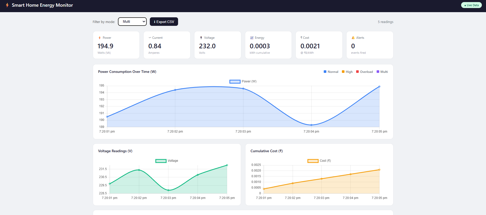
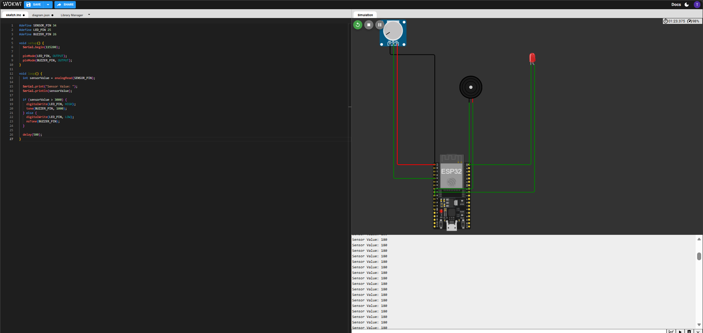

# Smart Home Energy Monitoring System


> Smart Home Energy Monitoring System using Python-based virtual sensors and a real-time web dashboard. Designed to demonstrate IoT concepts including ESP32, MQTT, energy analytics, alerts, and cloud dashboards without requiring physical hardware.

---

## Problem Statement

Homes and small businesses have no visibility into _where_ electricity goes.
This project delivers utility-grade per-circuit energy insights using low-cost,
non-invasive sensors — no electrician required for the electronics side.

---

---

## Project Overview

This project simulates a smart home energy monitoring system that tracks electrical consumption, estimates cost, detects overload conditions, and visualizes data on a live dashboard.

Although no physical hardware is used during execution, the project includes complete ESP32 firmware, MQTT architecture, and circuit diagrams showing how the system would work in a real deployment.

---

## 🏗️ Architecture

```
SCT-013 Clamp
     │
     ▼
Bias + RC Filter
     │
     ▼
ESP32 ADC (RMS sampling @ 4 kHz)
     │
     ▼
JSON payload via MQTT (PubSubClient)
     │
     ├──► Home Assistant (alerts, automations)
     │
     └──► Telegraf → InfluxDB → Grafana (historical charts)

Python Simulation (no hardware needed):
     simulator.py → MQTT / CSV → report_generator.py → PDF
```

---

## 📊 Screenshots

### 🔌 Virtual Circuit Diagram (Wokwi)


### 📈 Energy Analytics Dashboard



### 📊 Power Consumption Graphs


### ⚡ Running Simulation



## 📦 Components

| Hardware                  | Purpose                             |
| ------------------------- | ----------------------------------- |
| ESP32-DevKitC             | MCU — Wi-Fi, ADC, MQTT              |
| SCT-013-050 current clamp | Non-invasive AC current sensing     |
| 2× 10kΩ, 100kΩ, 100Ω      | Bias divider + protection           |
| 10µF + 0.1µF capacitors   | Bias decoupling + anti-alias filter |
| 3.5mm audio jack          | Clamp connector                     |
| ADS1115 (optional)        | 16-bit ADC for multi-channel        |
| Buzzer / LED (optional)   | Local alert indicator               |

| Software           | Purpose                |
| ------------------ | ---------------------- |
| Arduino ESP32 core | Firmware               |
| PubSubClient       | MQTT publishing        |
| Eclipse Mosquitto  | MQTT broker            |
| InfluxDB v2        | Time-series storage    |
| Telegraf           | MQTT → InfluxDB bridge |
| Grafana            | Dashboard & charts     |
| Home Assistant     | Automations & alerts   |
| Python 3.10+       | Simulation & reports   |
| paho-mqtt          | Python MQTT client     |
| reportlab          | PDF report generation  |

---

## 📁 Folder Structure

```
Smart-Home-Energy-Monitoring-System/
│
├── arduino_code/
│   └── main.cpp
│
├── dashboard/
│   ├── energy.html
│   ├── docker-compose.yml
│   ├── home_assistant_sensors.yaml
│   ├── telegraf.conf
│   └── mosquitto/
│
├── data/
│   ├── energy_data.json
│   └── energy_log.csv
│
├── python_simulation/
│   ├── simulator.py
│   ├── live_simulator.py
│   └── report_generator.py
│
├── outputs/
│   └── energy_report.pdf
│
├── circuit_diagram/
│   └── wiring_guide.md
│
├── docs/
│   └── interview_qa.md
│
├── main.py
├── requirements.txt
└── README.md
```

---

## 🚀 Setup & Execution

### Option A — Python Simulation (no hardware)

```bash
# 1. Clone
git clone https://github.com/Sonia068/Smart-Home-Energy-Monitoring-System
cd Smart-Home-Energy-Monitoring-System

# 2. Install dependencies
pip install -r requirements.txt

# 3. Run normal simulation (30 readings, ~30 seconds)
python main.py

# 4. Run overload scenario + generate PDF report
python main.py --mode overload --readings 20 --report

# 5. All modes
python main.py --mode normal    # everyday household
python main.py --mode high      # heavy appliances
python main.py --mode overload  # triggers alerts
python main.py --mode multi     # 6 mixed appliances

# 6. Report only (from saved CSV)
python main.py --report-only
```

### Option B — Full Stack with Docker

```bash
# Start Mosquitto + InfluxDB + Grafana + Telegraf
cd dashboard
docker compose up -d

# Check all services running
docker compose ps

# View Grafana at http://localhost:3000  (admin/admin)
# View InfluxDB at http://localhost:8086

# Run simulator pointing to local broker
cd ..
python main.py --mode multi --readings 120
```

### Option C — Real Hardware (ESP32)

See detailed steps in **Hardware Execution** section below.

---

## 🔧 Hardware Execution (Real ESP32)

### Step 1 — Install Arduino IDE + ESP32 board

```
Arduino IDE → File → Preferences → Board Manager URLs:
https://raw.githubusercontent.com/espressif/arduino-esp32/gh-pages/package_esp32_index.json

Tools → Board → Boards Manager → search "esp32" → Install
```

### Step 2 — Install Libraries

```
Sketch → Include Library → Manage Libraries:
- PubSubClient  (knolleary)
- Adafruit ADS1X15  (optional, for external ADC)
```

### Step 3 — Configure Firmware

Edit `arduino_code/main.cpp`:

```cpp
const char* WIFI_SSID = "YOUR_HOME_WIFI";
const char* WIFI_PASS = "YOUR_PASSWORD";
const char* MQTT_HOST = "192.168.1.10";   // your broker IP
```

### Step 4 — Upload

```
Tools → Board → ESP32 Dev Module
Tools → Port  → COM3 (or /dev/ttyUSB0 on Linux)
Sketch → Upload
```

### Step 5 — Wire the Circuit

Follow `circuit_diagram/wiring_guide.md`.  
**Ask a licensed electrician to place the clamp on the mains wire.**

### Step 6 — Calibrate

1. Plug in a known load (e.g., a 60 W bulb).
2. Open Serial Monitor (115200 baud).
3. Expected current = 60 / 230 = 0.261 A.
4. If reading is off, type: `CAL:0.XXXXX` in Serial Monitor to set new factor.

### Step 7 — Start Stack

```bash
cd dashboard
docker compose up -d
```

### Step 8 — Add HA Sensors

Paste `dashboard/home_assistant_sensors.yaml` into Home Assistant's
`configuration.yaml` and restart HA.

---

## 📊 Sample Console Output

```
=== Smart Home Energy Monitor ===
Active Appliances:
  • LED Lights             40W  PF=0.95
  • Ceiling Fan            75W  PF=0.85
  • Laptop                 65W  PF=0.90
  TOTAL                   180W

[  1/ 30] 2025-08-14T10:00:01  MODE=NORMAL   V= 229.3V  I=  0.791A  P=   181.4W  ██  ΣkWh=0.0001  ₹0.0004
[  2/ 30] 2025-08-14T10:00:02  MODE=NORMAL   V= 231.1V  I=  0.778A  P=   179.9W  █   ΣkWh=0.0001  ₹0.0008
...
[  8/ 30] ... ⚠ ALERT
         ↳ SPIKE: Transient load spike detected
```

---

## 📈 Formulas

| Parameter         | Formula                   |
| ----------------- | ------------------------- |
| RMS Current       | Irms = √( Σ(i²) / N )     |
| Apparent Power    | S (VA) = Irms × Vnominal  |
| Energy (interval) | ΔWh = S(W) × Δt(s) / 3600 |
| Cumulative kWh    | kWh = ΣΔWh / 1000         |
| Cost              | ₹ = kWh × tariff (₹8/kWh) |

---

## 🌍 Industry Relevance

| Sector               | Application                                 |
| -------------------- | ------------------------------------------- |
| Smart Homes          | Per-appliance usage, bill splitting         |
| Hostels / PGs        | Tenant sub-metering                         |
| Commercial Buildings | HVAC & lighting baselines, peak shaving     |
| Factories            | Motor health monitoring, overload detection |
| Solar Companies      | Net metering, consumption vs. generation    |
| Building Automation  | SCADA-like dashboards at low cost           |

---

## 🔮 Future Improvements

- Appliance-level NILM (non-intrusive load monitoring)
- Mobile app (Flutter / React Native)
- AI/ML energy forecasting
- Solar generation vs. consumption overlay
- Voice assistant integration (Alexa / Google)
- Automated load shedding relay control
- OTA firmware updates (ArduinoOTA)

## 🎥 Demo Video

[](https://youtu.be/N2UOhCDaCas)

👉 **Click the image above to watch the full demo of the Smart Home Energy Monitoring System**

---

## 🚀 Execution Steps

### Install Dependencies

```bash
pip install -r requirements.txt
```

### Generate Live Data

```bash
cd python_simulation
python live_simulator.py
```

The simulator continuously updates:

- energy_data.json
- energy_log.csv

## 📊 Energy Calculations

Power:

```
Power (W) = Voltage × Current
```

Energy:

```
Energy (Wh) = Power × Time / 3600
```

Cost:

```
Cost = kWh × ₹8 per unit
```

---

## Features

Live dashboard update
Power analytic
Voltage monitorin
Energy calculatio
Cost estimatio
Overload detectio
Alert loggin
CSV expor
PDF report generatio
ESP32 firmware include
Circuit diagram included

---

## Real Hardware Implementation (Future Deployment)

The project includes complete implementation files for:

```
SCT-013 Current Sensor
        │
        ▼
ESP32 ADC
        │
        ▼
MQTT Broker
        │
        ▼
InfluxDB
        │
        ▼
Grafana Dashboard
        │
        ▼
Home Assistant Alerts
```

---

## 👨‍💻 Author

**Sonia Thakur**

- GitHub: [@Sonia068](https://github.com/Sonia068/Smart-Home-Energy-Monitoring-System.git)
- LinkedIn: https://www.linkedin.com/in/sonia-thakur-6ab93b349/

---

⭐ **If you found this project helpful, please give it a star!**
